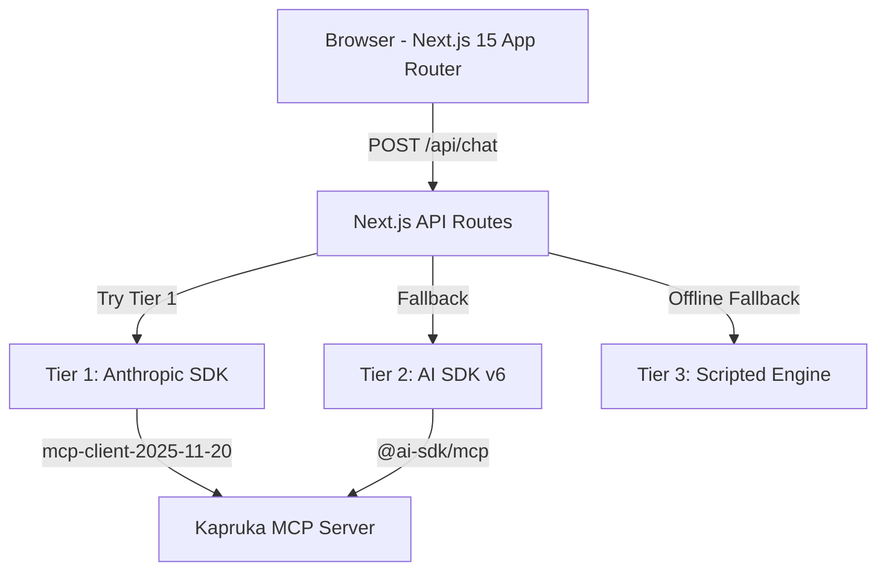
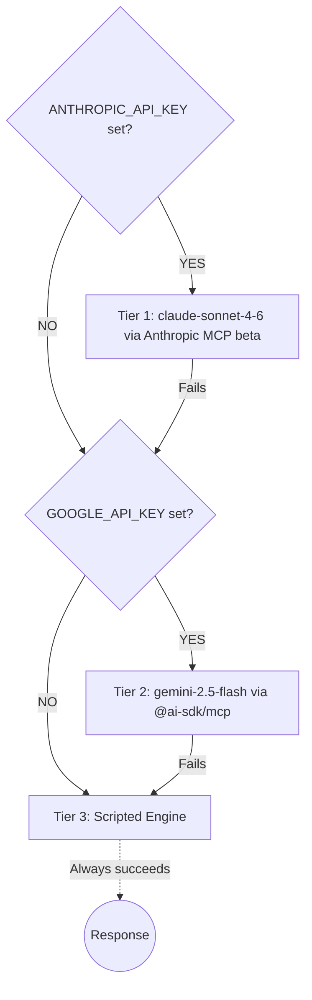
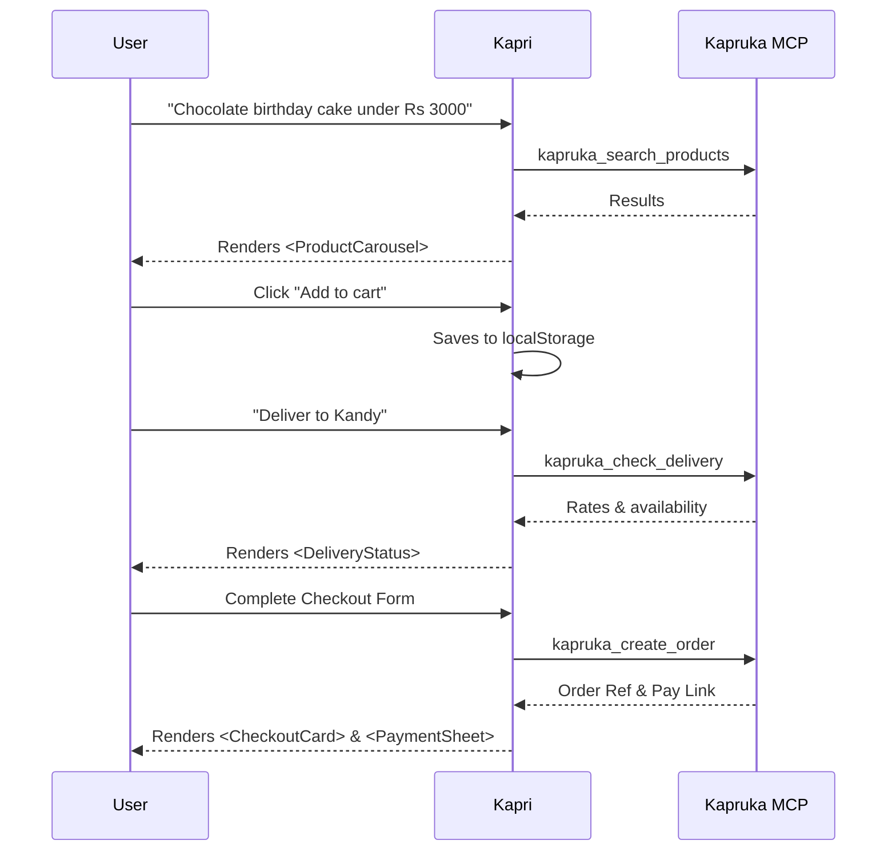

# Kapri — AI Shopping Concierge for Kapruka

> **Kapruka Agent Challenge 2026** · Entry by [@LasaKaru](https://github.com/LasaKaru)  
> Prize: Apple M4 Mac Mini · Deadline: 30 June 2026

Kapri is a full-screen, multilingual AI shopping concierge built on top of the [Kapruka MCP](https://mcp.kapruka.com/mcp) — Sri Lanka's largest e-commerce platform. It guides shoppers from "I'm not sure what to buy" to a **real Kapruka guest-checkout pay link**, entirely through rich generative UI.

## 🎯 Goal & Strategy

> Build Sri Lanka's most polished, full-screen, multilingual AI shopping agent on top of the public Kapruka MCP, deployed to a reliable public URL.

The rubric gives **50 of 100 points to look-and-feel** (Experience & Polish 30 + Visual Richness 20). So the build order is deliberately *experience-first*: get a beautiful, fast, full-screen chat shell rendering rich generative product UI before adding breadth. Then close the loop end-to-end (discovery → cart → delivery validation → checkout pay link). Then capture the **highest-leverage bonus**: Sinhala / Tanglish.

## 🔑 Key Facts
- **MCP endpoint:** `https://mcp.kapruka.com/mcp` — Streamable HTTP, no auth.
- **Limits:** 60 requests/min per IP across all tools; 30 `create_order`/hour per IP.
- **Brand palette (sampled from official logo):** purple `#442A73`, yellow `#F9DB09`, white `#FFFFFF`. 
- **Stack of record:** Next.js 15 (App Router) + Vercel AI SDK 6 (`@ai-sdk/mcp` is now stable) + Anthropic Claude, deployed on Vercel.

---

## ✨ Features

- **Understands vague intent** — "a nice gift for my mother under Rs. 5000" triggers a curated product carousel, not a text list.
- **Speaks Sinhala, Tanglish, and English** — the model detects language and responds in kind; city names in Sinhala resolve to real Kapruka delivery cities.
- **True multi-item cart** — persistent cart (localStorage-backed), visible badge, drawer with quantity controls.
- **Delivery validation** — city autocomplete, date picker, live perishable warnings for cakes/flowers, flat-fee display.
- **Gift message enhancer** — AI-rewritten gift messages in English or Sinhala.
- **End-to-end checkout** — collects recipient, sender, delivery details, and calls `kapruka_create_order` for a real pay link.
- **Order tracking** — paste a `VIMP…` order number to get a live progress timeline.
- **Voice input** — Web Speech API with `si-LK` locale for Sinhala voice prompts.
- **Graceful fallback** — three-tier AI chain ensures the app always responds even without API keys.

---

## 🏗️ Architecture



The browser never touches Anthropic, Google, or Kapruka directly — all calls are proxied through the Next.js API routes to keep secrets server-side.

---

## 🧠 AI Provider Fallback Chain



---

## 🛠️ Key Design Decisions

### 1. Anthropic MCP beta proxy (`betas: ['mcp-client-2025-11-20']`)
The Kapruka MCP server IP-allowlists Anthropic and Vercel. Using the Anthropic SDK's MCP client beta routes all MCP calls through Anthropic's own infrastructure — so the app works from any environment including local dev and CI.

### 2. Static Zod schemas for Gemini (`{ schemas: KAPRUKA_SCHEMAS }`)
Gemini rejects dynamically-discovered tool schemas. The fix is to pass explicit Zod schemas to `client.tools()`. The MCP client still executes the real tools — only schema discovery is bypassed.

### 3. Structured JSON protocol over plain text
The system prompt instructs every AI model to respond **only** with valid JSON matching `EngineResponse`. `parseClaudeResponse` handles cases where the model wraps output in code fences, and normalises MCP price objects `{ amount, currency }` into plain numbers for the UI.

### 4. localStorage cart persistence
Cart state lives in `localStorage` under `kapri_cart`. On every `send()` call the full cart is serialised and re-injected into the API request body, then into the system prompt — so the model always has authoritative cart context without relying on LLM memory.

---

## 🛒 End-to-End Shopping Workflow



---

## 💻 Tech Stack

| Layer | Choice | Version |
|---|---|---|
| Framework | Next.js App Router | 15 |
| Language | TypeScript | 5 |
| UI | React | 18 |
| Styling | Tailwind CSS + CSS custom properties | 3 |
| AI — Primary | `@anthropic-ai/sdk` (Anthropic SDK) | 0.102 |
| AI — Fallback | `ai` + `@ai-sdk/google` (Vercel AI SDK) | 6.0 |
| MCP client | `@ai-sdk/mcp` | 1.0 |
| Schema validation | Zod | 3.25 |

---

## 🏆 Rubric Coverage (100 pts)

| Category | Pts | How Kapri scores |
|---|---|---|
| **Experience & Polish** | 30 | Full-screen app shell; optimistic message UI; skeleton loaders; mobile-first (380px); localStorage state sync; no layout shift; smooth card transitions; safe-area insets |
| **Visual Richness** | 20 | Zero raw-text product lists — every result is a generative component |
| **Personality** | 15 | Named "Kapri"; warm, proactive Sri Lankan voice; seasonal occasion awareness |
| **Usefulness** | 15 | Budget parsing; vague-intent clarification; delivery validation with perishable warnings; city name aliases |
| **End-to-end completeness** | 15 | Discovery → cart → delivery check → checkout form → `kapruka_create_order` → real pay link → order tracking |
| **Creativity** | 5 | AI Gift Bundle Builder; Sinhala voice input (`si-LK`); gift message AI-enhancer |
| **Total** | **100** | |

---

## ❓ FAQ

**Q: Why does the order tracking show a dummy order when I track a real Kapruka order (like VIMP27778)?**

You hit the nail right on the head! Because this is currently a prototype and isn't connected to Kapruka's real, private internal database, it has no way to actually fetch real-world orders (like VIMP27778) from the live Kapruka servers.

Here is exactly what happens under the hood when you type a tracking number:
1. The app first checks its own database (the Vercel KV database) to see if you placed that order inside this demo app.
2. If it can't find it (because `VIMP27778` is a real Kapruka order from the outside world, not from this demo), the app returns `null`.
3. Because this is a UI prototype, rather than showing a boring "Order Not Found" error, the app gracefully falls back to displaying the `DEMO_ORDER` template (the Cake, Roses, and Chocolates) so you can still see what the tracking UI looks like. 
4. However, it dynamically replaces the number on that demo order with the one you typed (`VIMP27778`) so it feels realistic!
5. If Kapruka eventually provides a real API endpoint for order tracking (e.g., `https://api.kapruka.com/orders/VIMP27778`), we can easily swap out the Vercel KV database call in `OrderTracker.tsx` to fetch the real data from Kapruka's servers!

---

## 🚀 Running Locally

```bash
# 1. Clone
git clone https://github.com/LasaKaru/kapri.git
cd kapri

# 2. Install
npm install

# 3. Configure
cp .env.local.example .env.local
# Edit .env.local — add at least ANTHROPIC_API_KEY for live Kapruka data

# 4. Run
npm run dev
# → http://localhost:3000
```

The app works without any API key (Tier 3 scripted engine). For live Kapruka data, add `ANTHROPIC_API_KEY`.

---

## ☁️ Deploying to Vercel

```bash
npm i -g vercel
vercel --prod
```

Or: Vercel dashboard → **Import Git Repository** → set env vars → **Deploy**.

Add environment variables in the Vercel project settings:
- `ANTHROPIC_API_KEY` — required for live MCP data
- `GOOGLE_GENERATIVE_AI_API_KEY` — optional Gemini fallback

**Important:** Do not complete real payments during development. Stop at the checkout URL. Stay under 30 `kapruka_create_order` calls per hour per the Kapruka MCP terms.

---

## 📜 License

MIT — competition entry, open-sourced for the Sri Lankan dev community.
