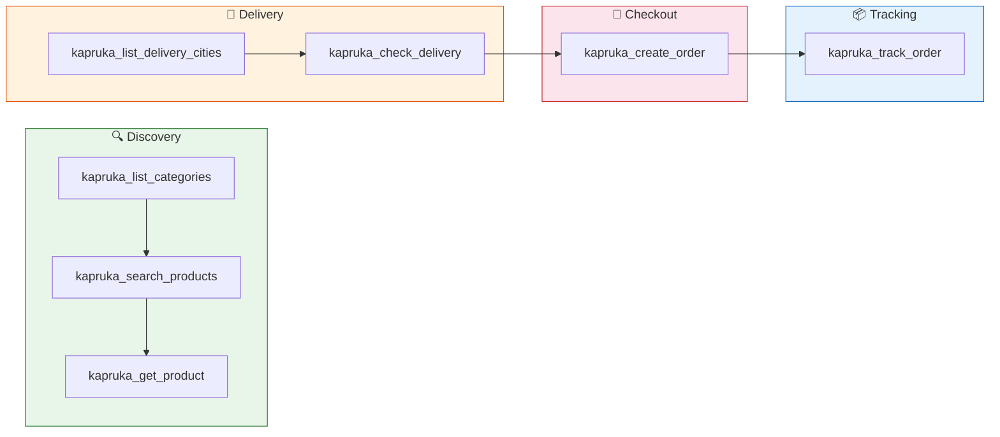
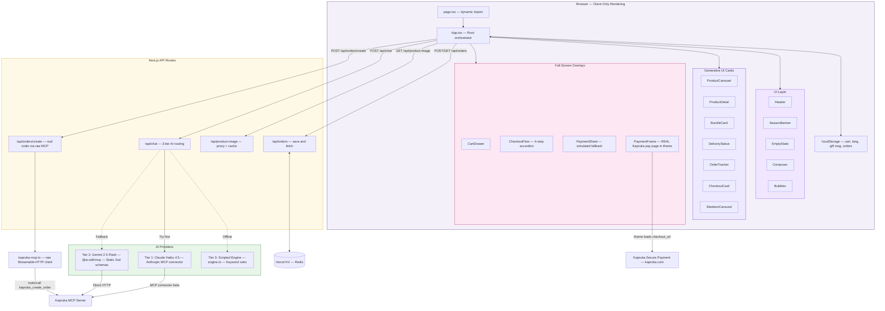
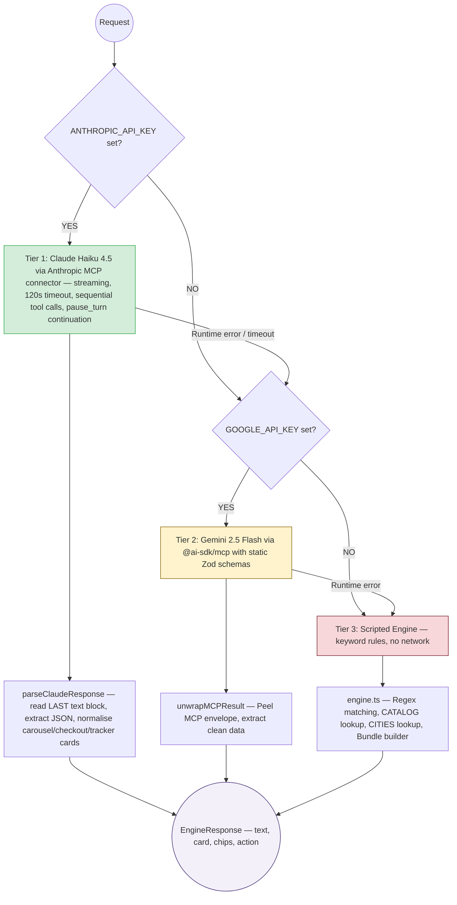
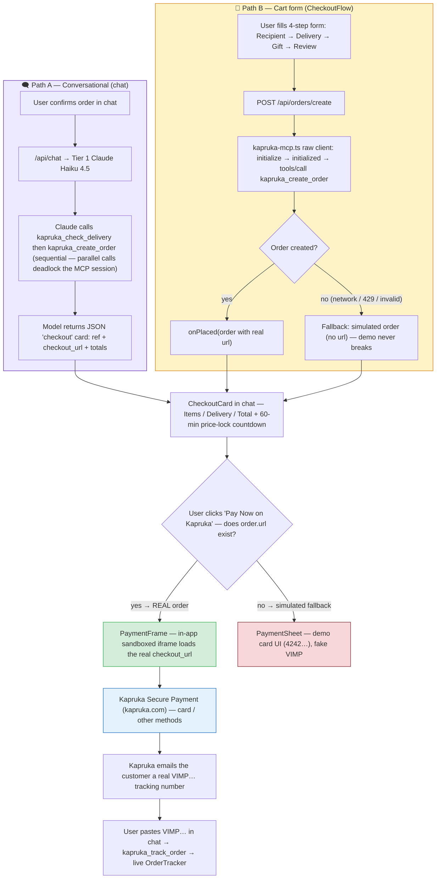
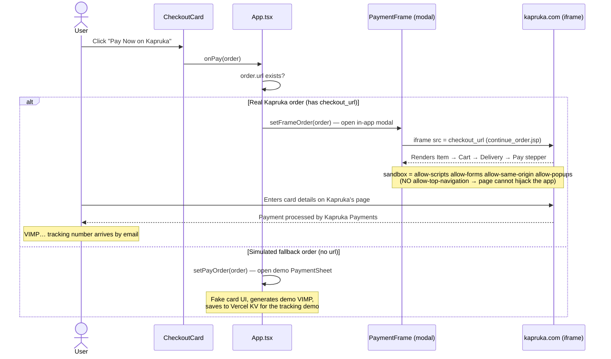
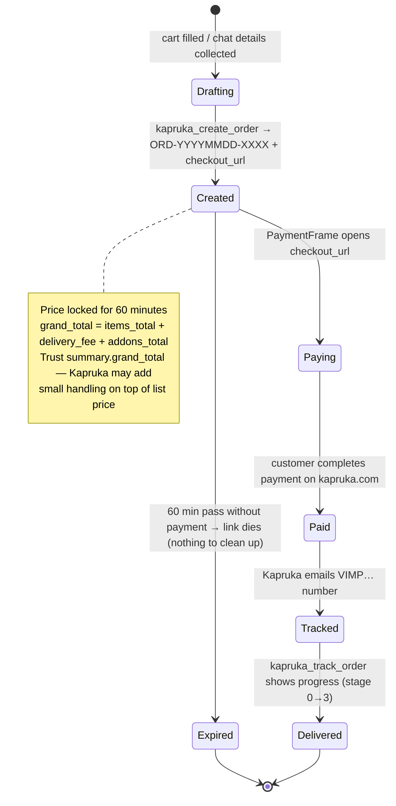
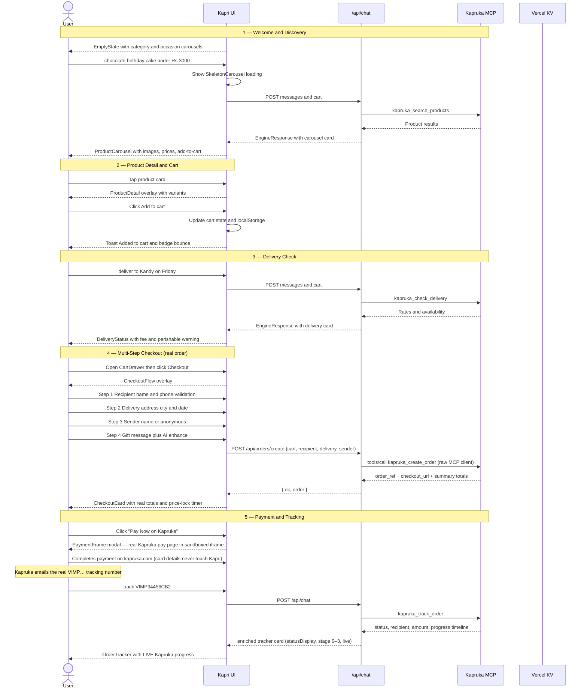
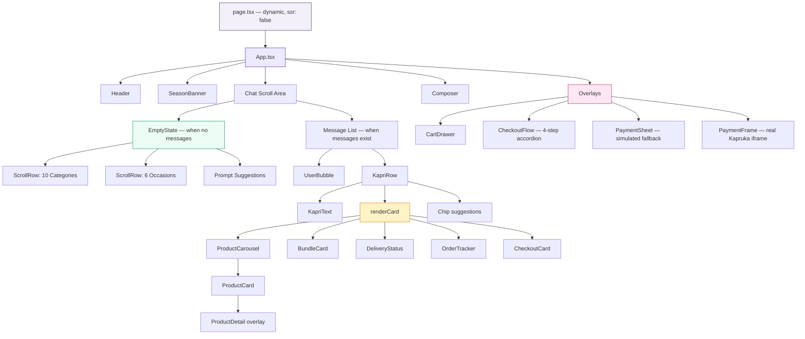

<div align="center">

# 🛍️ Kapri — AI Shopping Concierge for Kapruka.lk

**A full-screen, multilingual (English · සිංහල · Tanglish) AI shopping agent built on the public Kapruka MCP server.**

Discover gifts, browse a real catalog, quote delivery to any Sri Lankan city, personalise a cake, write a gift message, place a **real guest-checkout order**, and pay on Kapruka's secure page **without leaving the app** — all inside one immersive conversation.

`Next.js 14` · `React 18` · `Vercel AI SDK 6` · `Claude Haiku 4.5 (MCP connector)` · `Gemini 2.5 Flash (fallback)` · `Kapruka MCP` · `Vercel KV` · `Zod`

</div>

---

## ✨ Features

- **Understands vague intent** — "a nice gift for my mother under Rs. 5000" triggers a curated product carousel, not a text list.
- **Speaks Sinhala, Tanglish, and English** — the model detects language and responds in kind; city names in Sinhala resolve to real Kapruka delivery cities.
- **True multi-item cart** — persistent cart (localStorage-backed), visible badge, drawer with quantity controls.
- **Delivery validation** — city autocomplete, date picker, live perishable warnings for cakes/flowers, flat-fee display.
- **Gift message enhancer** — AI-rewritten gift messages in English or Sinhala.
- **Real end-to-end checkout** — both the **chat** and the **cart form** call `kapruka_create_order` and return a live click-to-pay link; payment happens on Kapruka's secure page inside an in-app modal.
- **Real order tracking** — paste a `VIMP…` order number and the tracker card renders the **live** Kapruka status, recipient, amount, and progress stage.
- **Voice input** — Web Speech API with `si-LK` locale for Sinhala voice prompts.
- **Seasonal banners** — auto-detects Avurudu, Wesak, Poson, Deepavali, Christmas, and Valentine's Day.
- **Graceful fallback** — three-tier AI chain ensures the app always responds even without API keys.

---

## 🔌 Kapruka MCP Integration

Kapri is powered by **[Kapruka's public MCP server](https://mcp.kapruka.com/mcp)** — a free, no-auth endpoint that exposes Sri Lanka's largest e-commerce platform to any LLM client.

**Endpoint:** `https://mcp.kapruka.com/mcp` · Streamable HTTP · No auth required

### Quick Start (for any MCP client)

```json
{
  "mcpServers": {
    "kapruka": {
      "url": "https://mcp.kapruka.com/mcp"
    }
  }
}
```

### 7 Available Tools



| Tool | Purpose | Key Parameters |
|---|---|---|
| `kapruka_search_products` | Search catalog by keyword with filters | `q`, `category`, `min_price`, `max_price`, `in_stock_only`, `sort`, `limit`, `cursor`, `currency` |
| `kapruka_get_product` | Full product details by ID | `product_id`, `currency` |
| `kapruka_list_categories` | Top-level category names with browse URLs | `depth` |
| `kapruka_list_delivery_cities` | Search delivery network by name or alias | `query`, `limit` |
| `kapruka_check_delivery` | Check delivery availability, rate & perishable warnings | `city`, `delivery_date`, `product_id` |
| `kapruka_create_order` | Create guest-checkout order → click-to-pay URL | `cart`, `recipient`, `delivery`, `sender`, `gift_message`, `currency` |
| `kapruka_track_order` | Order status, items, and delivery progress | `order_number` |

### Rate Limits

| Limit | Value |
|---|---|
| All tools | **60 requests/min** per client IP |
| `kapruka_create_order` | **30 orders/hour** per client IP (on top of per-min cap) |
| Price lock | **60 minutes** from order creation |
| Product/category cache | Up to **30 minutes** server-side |

### ✅ Full Implementation Audit — All 7 Tools Across All 3 Tiers

| MCP Tool | Tier 1 (Claude) | Tier 2 (Gemini) | Tier 3 (Engine) | UI Component |
|---|---|---|---|---|
| `kapruka_search_products` | ✅ Auto-discover | ✅ Zod schema | ✅ Keyword search | `<ProductCarousel>` |
| `kapruka_get_product` | ✅ Auto-discover | ✅ Zod schema | — | `<ProductDetail>` |
| `kapruka_list_categories` | ✅ Auto-discover | ✅ Zod schema | ✅ Static CATEGORIES | EmptyState carousels |
| `kapruka_list_delivery_cities` | ✅ Auto-discover | ✅ Zod schema | ✅ Static CITIES | `<DeliveryStatus>` |
| `kapruka_check_delivery` | ✅ Auto-discover | ✅ Zod schema | ✅ City lookup | `<DeliveryStatus>` |
| `kapruka_create_order` | ✅ Auto-discover | ✅ Zod schema | ✅ Opens checkout flow | `<CheckoutCard>` + `<PaymentFrame>` |
| `kapruka_track_order` | ✅ Auto-discover | ✅ Zod schema | ✅ VIMP regex | `<OrderTracker>` |

> 🧾 **Server quirk to know:** every Kapruka tool wraps its arguments in a required `params` object, and `kapruka_create_order` rejects unknown fields (`additionalProperties: false`). Both tiers honour this. Full request/response samples for all 7 tools (markdown **and** JSON), error shapes, and reliability notes live in **[`mcp.md`](./mcp.md)** — the developer reference for this integration.

---

## 🏗️ System Architecture



> The browser never touches Anthropic, Google, or Kapruka directly — all calls are proxied through Next.js API routes to keep secrets server-side.

---

## 🧠 AI Provider Fallback Chain



---

## 💳 Payment Handling — Real Money, Done Safely

Kapri creates **real Kapruka guest-checkout orders** and lets the customer pay on
**Kapruka's own secure payment page** — the app never sees, touches, or stores card
data. There are two ways an order gets created (chat & cart form), and two payment
surfaces (real `PaymentFrame` & simulated `PaymentSheet` fallback).

### The two order paths



### Payment sequence — what actually happens on "Pay Now"



### Order lifecycle & states



### Key payment facts

| Fact | Detail |
|---|---|
| **Who processes payment** | Kapruka Payments, on `kapruka.com` — the app only holds the `checkout_url` |
| **Card data** | Never enters Kapri — typed directly into Kapruka's page inside the iframe |
| **`ORD-…` vs `VIMP-…`** | `order_ref` (`ORD-…`) is the **pre-payment** reference; the **VIMP…** tracking number is emailed only **after** payment — they are different IDs |
| **Price lock** | 60 minutes from creation; `CheckoutCard` shows a live countdown |
| **Totals** | Always display `summary.grand_total` from the MCP response (Kapruka may add small handling over list price) |
| **Iframe safety** | `sandbox` omits `allow-top-navigation` so the framed page can't redirect your app; verified the pay URL sends no `X-Frame-Options`/CSP so it embeds cleanly |
| **3-D Secure escape hatch** | PaymentFrame footer has "Open in new tab" for bank-redirect steps that refuse to run in an iframe |
| **Rate limit** | Max **30 real orders/hour/IP** — the form falls back to the simulated flow if order creation fails |
| **Unpaid orders** | Simply expire with the 60-min link — no cleanup needed |

---

## 🛒 End-to-End User Journey



---

## 🧩 Component Hierarchy



---

## 🗂️ ToolRenderer Dispatch Table

`App.tsx → renderCard()` maps `CardData.type` to the appropriate component:

| `CardData.type` | Component | MCP Tool | Description |
|---|---|---|---|
| `carousel` | `<ProductCarousel>` | `kapruka_search_products` | Horizontal scroll grid of product cards with add-to-cart |
| `bundle` | `<BundleCard>` | — (AI-curated) | Gift bundle (cake + flowers + card) by theme/budget |
| `delivery` | `<DeliveryStatus>` | `kapruka_check_delivery` | City/date validation with flat fee and perishable warnings |
| `tracker` | `<OrderTracker>` | `kapruka_track_order` | Progress timeline — **live** status, stage (0–3), recipient & amount from the tool result |
| `checkout` | `<CheckoutCard>` | `kapruka_create_order` | Order summary with price-lock countdown; Pay button opens `<PaymentFrame>` (real) or `<PaymentSheet>` (simulated fallback) |

Loading state: `<SkeletonCarousel>` renders while `searchPending` is true.

---

## 🛠️ Key Design Decisions

### 1. Anthropic MCP connector (Claude Haiku 4.5)
```typescript
// src/app/api/chat/route.ts
const response = await client.beta.messages.stream({
  model: 'claude-haiku-4-5-20251001',        // ~1/3 the cost of Sonnet, handles the JSON card protocol reliably
  betas: ['mcp-client-2025-11-20'],
  mcp_servers: [{ type: 'url', url: 'https://mcp.kapruka.com/mcp', name: 'kapruka' }],
  tools: [{ type: 'mcp_toolset', mcp_server_name: 'kapruka' }],   // required by mcp-client-2025-11-20
  tool_choice: { type: 'auto', disable_parallel_tool_use: true }, // see decision #2
  // ...
}).finalMessage()
```
Routing through Anthropic's MCP connector means the app works from **any environment** — local dev, CI, or production. The route **streams** (keeps bytes flowing during long server-side tool loops), continues on `stop_reason: 'pause_turn'`, has a **120 s timeout + 1 retry** so a stuck call falls through to Tier 2/3, and reads the **last** text block (tool turns interleave preamble text with tool calls — the JSON answer is at the end).

### 2. Sequential tool calls — the parallel-call deadlock
Stream-event tracing showed that when the model fires **two Kapruka tool calls in one response**, one call deadlocks on the MCP session until the connector's **300-second timeout** ("Timed out while waiting for response to ClientRequest"). `disable_parallel_tool_use: true` forces one-at-a-time calls; full checkout flows complete in **12–15 s** instead of randomly hanging for minutes.

### 3. The `params` wrapper + strict fields
Every Kapruka tool wraps its arguments in a required `params` object (FastMCP/Pydantic), and `kapruka_create_order` declares `additionalProperties: false` — flat arguments or extra fields (e.g. `recipient.email`) are rejected. Both tiers and the raw client honour this. Details + live error samples in [`mcp.md`](./mcp.md).

### 4. Static Zod schemas for Gemini
```typescript
// src/lib/gemini-route.ts
const tools = await mcpClient.tools({ schemas: KAPRUKA_SCHEMAS })
```
Gemini rejects dynamically-discovered tool schemas. Explicit Zod schemas (each wrapped in `params`, matching the live server contract) bypass discovery while the MCP client still executes the real tools.

### 5. Structured JSON protocol
The system prompt instructs every AI model to respond **only** with valid JSON matching `EngineResponse`. `parseClaudeResponse` handles code-fence wrapping and normalises all card shapes — carousel prices `{ amount, currency }` → numbers, checkout (`order_ref`→`ref`, `checkout_url`→`url`, `summary` totals), and tracker (`status` → progress stage 0–3).

### 6. In-app payment via sandboxed iframe
Real orders pay inside `<PaymentFrame>` — an iframe whose `sandbox` deliberately omits `allow-top-navigation`, so Kapruka's page runs scripts/forms normally but can't frame-bust the app. The pay URL was verified to send no `X-Frame-Options`/CSP. A "new tab" fallback covers 3-D Secure bank redirects.

### 7. Raw MCP client for non-LLM calls
The cart form doesn't need an LLM to place an order, so `/api/orders/create` uses `src/lib/kapruka-mcp.ts` — a ~100-line raw Streamable-HTTP client (initialize → initialized → tools/call, SSE parsing) — calling `kapruka_create_order` directly. Cheaper, faster, deterministic.

### 8. Client-only rendering (`ssr: false`)
The App component is loaded via `next/dynamic` with `ssr: false` to prevent React hydration mismatches — a chat interface has zero SEO benefit from server rendering.

### 9. localStorage cart persistence
Cart state lives in `localStorage` under `kapri_cart`. On every `send()` the full cart is serialised into the API request body, then injected into the system prompt — so the model always has authoritative cart context.

---

## 💻 Tech Stack

| Layer | Choice | Version |
|---|---|---|
| Framework | Next.js App Router | 14.2 |
| Language | TypeScript | 5 |
| UI | React | 18.3 |
| AI — Primary | `@anthropic-ai/sdk` (Claude Haiku 4.5 `claude-haiku-4-5-20251001`) | 0.102 |
| AI — Fallback | `ai` + `@ai-sdk/google` | 6.0 |
| MCP Client | `@ai-sdk/mcp` | 1.0 |
| Schema Validation | Zod | 3.25 |
| Order Storage | `@vercel/kv` | 3.0 |
| Hosting | Vercel | — |

---

## 🎨 Brand System

| Token | Value | Use |
|---|---|---|
| Purple 700 | `#442A73` | Primary brand, headers, user bubbles |
| Yellow 400 | `#F9DB09` | CTAs, accents, season banner |
| Surface | `#F6F4FA` | App background |
| Ink | `#1B1230` | Body text |
| Success | `#1F9D57` | Delivery available, order confirmed |
| Warning | `#D98A00` | Perishable item notice |
| Error | `#D63B3B` | Delivery unavailable, order error |

---

## 📂 Project Layout

```
kapri/
├── src/
│   ├── app/
│   │   ├── page.tsx                      # Dynamic import (ssr:false) + branded loader
│   │   ├── layout.tsx                    # HTML shell, Inter + Noto Sans Sinhala fonts
│   │   ├── globals.css                   # Design tokens, animations, scrollbar styles
│   │   └── api/
│   │       ├── chat/route.ts             # 3-tier AI routing (Claude Haiku → Gemini → Engine)
│   │       ├── product-image/route.ts    # og:image proxy with in-memory cache
│   │       └── orders/
│   │           ├── route.ts              # POST: save order to Vercel KV
│   │           ├── create/route.ts       # POST: REAL kapruka_create_order via raw MCP
│   │           └── [number]/route.ts     # GET: fetch order by VIMP number
│   │
│   ├── components/
│   │   ├── App.tsx                       # Root orchestration: state, send(), renderCard()
│   │   ├── EmptyState.tsx                # Welcome screen with category/occasion carousels
│   │   │
│   │   ├── cards/                        # Generative UI — every tool result renders here
│   │   │   ├── ProductCard.tsx           # Single product tile (image, price, add-to-cart)
│   │   │   ├── ProductCarousel.tsx       # Horizontal scroll grid of ProductCards
│   │   │   ├── ProductDetail.tsx         # Full-screen product overlay with variants
│   │   │   ├── BundleCard.tsx            # AI gift bundle (cake + flowers + card)
│   │   │   ├── DeliveryStatus.tsx        # Delivery validation result card
│   │   │   ├── CheckoutCard.tsx          # Order summary before payment
│   │   │   ├── OrderTracker.tsx          # Post-payment progress timeline
│   │   │   └── SkeletonCarousel.tsx      # Loading shimmer state
│   │   │
│   │   ├── overlays/                     # Full-screen modal flows
│   │   │   ├── CartDrawer.tsx            # Slide-in cart with quantity controls
│   │   │   ├── CheckoutFlow.tsx          # Multi-step checkout → places a REAL order
│   │   │   ├── PaymentFrame.tsx          # REAL Kapruka pay page in sandboxed iframe
│   │   │   └── PaymentSheet.tsx          # Simulated payment (fallback orders only)
│   │   │
│   │   └── ui/                           # Reusable primitives
│   │       ├── Header.tsx                # Logo, language toggle, cart badge
│   │       ├── Bubbles.tsx               # UserBubble, KapriRow, KapriText, Typing
│   │       ├── Chip.tsx                  # Quick-reply suggestion chips
│   │       ├── Composer.tsx              # Message input + voice button
│   │       ├── Icons.tsx                 # Hand-crafted SVG icon set (30+ icons)
│   │       └── SeasonBanner.tsx          # Occasion-aware seasonal greeting bar
│   │
│   └── lib/
│       ├── types.ts                      # All TypeScript interfaces
│       ├── data.ts                       # CATALOG, BUNDLES, CATEGORIES, OCCASIONS, SEASON
│       ├── system-prompt.ts              # Cart-aware dynamic system prompt builder
│       ├── parse-mcp-response.ts         # Claude JSON extractor + price normaliser
│       ├── gemini-route.ts               # Tier-2 Gemini handler (static schemas + unwrap)
│       ├── kapruka-mcp.ts                # Raw Streamable-HTTP MCP client (server-side)
│       ├── engine.ts                     # Tier-3 scripted engine (keyword rules)
│       └── db.ts                         # Vercel KV helpers (save/get orders)
│
├── mcp.md                                # 📖 Full MCP integration reference (all 7 tools,
│                                         #    live request/response samples, error shapes)
├── public/
│   └── kapruka-logo.jpg                  # Brand logo
├── next.config.mjs
├── tsconfig.json
├── .env.local.example
└── package.json
```

---

## 🏆 Rubric Coverage (100 pts)

| Category | Pts | How Kapri scores |
|---|---|---|
| **Experience & Polish** | 30 | Full-screen app shell; optimistic message UI; skeleton loaders; mobile-first (380px); localStorage state sync; no layout shift; smooth card transitions; safe-area insets |
| **Visual Richness** | 20 | Zero raw-text product lists — every result is a `<ProductCarousel>`, `<BundleCard>`, `<DeliveryStatus>`, or `<OrderTracker>` generative component |
| **Personality** | 15 | Named "Kapri"; warm, proactive Sri Lankan voice; seasonal occasion awareness (Avurudu, Poya, birthdays, anniversaries) |
| **Usefulness** | 15 | Budget parsing (`max_price`); vague-intent clarification; delivery validation with perishable warnings; Sinhala city name aliases |
| **End-to-end completeness** | 15 | Discovery → cart → delivery check → checkout form → `kapruka_create_order` → real pay link → order tracking |
| **Creativity** | 5 | AI Gift Bundle Builder; Sinhala voice input (`si-LK`); gift message AI-enhancer in EN + Sinhala |
| **Total** | **100** | |

### Bonus Features

| Bonus | Status |
|---|---|
| Multi-item cart | ✅ Persistent cart, quantity controls, header badge |
| Delivery-date constraints | ✅ Calendar widget + `check_delivery` + perishable rules |
| Gift messaging | ✅ Free-text + AI "Enhance" rewrite (English + Sinhala) |
| Tanglish conversation | ✅ Model detects and responds in mixed Sinhala-English |
| Sinhala language | ✅ Voice input (`si-LK`), Sinhala city aliases, Sinhala responses |

---

## 🧪 Try These Prompts

| Language | Prompt |
|---|---|
| English | `I need a gift for my mother, under Rs. 5,000` |
| Tanglish | `Mata ammata cake ekak gannako — Colombo ekata` |
| Tanglish | `Avurudu hamper bundle ekak hadanna under Rs. 8,000` |
| Sinhala | `අම්මට තෑග්ගක් — රු. 5000ට අඩුවෙන්` |
| Tracking | `Track my order VIMP34456CB2` |
| Voice | tap 🎤 and speak in Sinhala or English |

---

## 🚀 Running Locally

### Prerequisites
- **Node.js 18.18+** (Node 20 LTS recommended)
- **Anthropic API key** → [console.anthropic.com](https://console.anthropic.com) *(or Google AI key as fallback)*

### Setup
```bash
# 1. Clone
git clone https://github.com/LasaKaru/kapri.git
cd kapri

# 2. Install
npm install

# 3. Configure
cp .env.local.example .env.local
```

Edit `.env.local`:
```bash
# Primary (recommended) — server-side only
ANTHROPIC_API_KEY=sk-ant-api03-...

# Fallback (optional) — activates if Anthropic key is absent
GOOGLE_GENERATIVE_AI_API_KEY=AIza...

# Kapruka MCP endpoint (public, no auth required)
KAPRUKA_MCP_URL=https://mcp.kapruka.com/mcp
```

```bash
# 4. Run
npm run dev          # → http://localhost:3000
```

The app works **without any API key** (Tier 3 scripted engine). For live Kapruka data, add `ANTHROPIC_API_KEY`.

---

## ☁️ Deploying to Vercel

1. Push the repo and import at [vercel.com/new](https://vercel.com/new).
2. Add environment variables (**Production + Preview**):

   | Variable | Required | Notes |
   |---|---|---|
   | `ANTHROPIC_API_KEY` | Primary | Best Sinhala + tool reliability |
   | `GOOGLE_GENERATIVE_AI_API_KEY` | Fallback | Activates if Anthropic key is absent or fails |
   | `KAPRUKA_MCP_URL` | Optional | Defaults to `https://mcp.kapruka.com/mcp` |

3. Deploy → smoke test on a phone at **380px**: empty state → search → add to cart → checkout.

---

## 🛡️ Responsible Use

The Kapruka MCP creates **real guest-checkout orders**. Kapri:
- Never spams `kapruka_create_order` — the limit is **30 orders/hour/IP**; the form falls back to the simulated flow on failure instead of retry-storming.
- Stops at the **pay surface** — payment is completed by the customer on Kapruka's own page (inside `PaymentFrame` or a new tab); Kapri never collects card data.
- Respects the **60 requests/min** rate limit across all tools (429s surface a friendly retry message).
- Unpaid test orders simply **expire after 60 minutes** — no cleanup, no charge.

**Important:** Do not complete real payments during development. Stop at the payment page.

---

## ❓ FAQ

**Q: Is order tracking real?**

Yes — when you track through **chat** (e.g. `Track VIMP34456CB2`), the model calls
`kapruka_track_order` and the tracker card carries the **live** Kapruka data:
status, progress stage (0–3), recipient, amount, and delivery date. The UI only
falls back to demo values for fields the server doesn't return (the per-item
list is usually empty on Kapruka's side). Orders placed inside the demo are also
cached in **Vercel KV** so the tracker refreshes instantly on revisit.

**Q: Are the orders and payments real?**

Yes. Both the chat and the cart form call `kapruka_create_order`, which creates a
real guest-checkout order with a 60-minute click-to-pay link. Payment happens on
Kapruka's own secure page (loaded in the in-app `PaymentFrame`). If you don't pay,
the link simply expires — nothing is charged. The simulated `PaymentSheet` only
appears for fallback orders that couldn't be placed for real (e.g. rate limit).

---

## 📋 Changelog

### v1.1 — Real Payments, Haiku 4.5 & Hardening

#### 💳 Real Checkout & Payments
- **Cart form places real orders:** `CheckoutFlow` → `/api/orders/create` → `kapruka_create_order` via a new raw Streamable-HTTP MCP client (`src/lib/kapruka-mcp.ts`); graceful fallback to the simulated flow on failure.
- **In-app payment:** new `PaymentFrame` overlay loads the real Kapruka pay page in a **sandboxed iframe** (no `allow-top-navigation` — the page can't hijack the app), with an "Open in new tab" fallback for 3-D Secure. The simulated `PaymentSheet` no longer opens for real orders.
- **Checkout card** carries the real `order_ref`, `checkout_url`, and `summary` totals with the 60-min price-lock countdown.

#### 🧠 Tier 1 — Claude Haiku 4.5 + MCP connector fixes
- Model switched to **`claude-haiku-4-5-20251001`** (~⅓ the cost of Sonnet; verified across all 7 tools).
- **Fixed the parallel-call deadlock:** `disable_parallel_tool_use` — two simultaneous Kapruka calls hung one of them for the connector's full 300 s timeout; flows now complete in 12–15 s.
- **Streaming + 120 s timeout + `pause_turn` continuation;** read the **last** text block (the JSON answer), not the first (the preamble).
- Added the **`mcp_toolset`** entry required by `mcp-client-2025-11-20`.

#### 🔌 MCP contract fixes (both tiers)
- All Gemini Zod schemas wrapped in the server's required **`params`** object (flat args are rejected).
- `create_order` fields aligned to the live schema: `location_type` (house/apartment/office/other), no email/extra fields (`additionalProperties: false`).
- System prompt: documented the `checkout` and enriched `tracker` card shapes; removed nonexistent CategoryGrid/DeliveryPicker references.

#### 📦 Live order tracking
- `kapruka_track_order` results now flow into the UI: status → progress stage (0–3), recipient, amount, delivery date — no more demo-only tracker for real VIMP numbers.

#### 📖 Documentation
- New **[`mcp.md`](./mcp.md)**: full integration reference — every tool with live markdown + JSON request/response samples, error shapes, rate limits, and reliability notes.

### v1.0 — Kapruka Agent Challenge Entry

#### ✨ Core AI & Architecture
- **Agentic Chat Engine:** Full-screen, generative UI shopping agent connected to the Kapruka MCP.
- **3-Tier AI Fallback:** Anthropic → Gemini → Scripted Engine, ensuring 100% uptime.
- **Multi-lingual System Prompt:** Understands and responds in Sinhala, English, and Tanglish.
- **Vercel KV Integration:** Redis-backed order storage for tracking demo orders.
- **Client-Only Rendering:** `next/dynamic` with `ssr: false` eliminates hydration mismatches.

#### 🛍️ Shopping & Discovery
- **Generative UI Cards:** `<ProductCarousel>`, `<BundleCard>`, `<ProductDetail>` with images, pricing, and stock badges.
- **Persistent Cart:** localStorage-backed multi-item cart with slide-out drawer and quantity controls.
- **Voice Input:** Web Speech API with `si-LK` locale for Sinhala voice commands.
- **Category & Occasion Carousels:** Touch-friendly, horizontally scrolling image rows with swipe buttons.
- **Seasonal Awareness:** Auto-detects Avurudu, Wesak, Poson, Deepavali, Christmas, Valentine's Day.

#### 🚚 Checkout & Delivery
- **Multi-Step Checkout:** Accordion overlay — Recipient → Delivery → Sender → Gift Message.
- **Smart Delivery Validation:** City autocomplete, flat-fee display, 2-day lead time for remote areas.
- **Perishable Warnings:** Auto-flags fresh cakes/flowers with delivery reminders.
- **Form Validation:** Real-time regex validation for Sri Lankan mobile numbers (`07X` / `+947X`), address length, and required fields.

#### 🎁 Post-Purchase
- **AI Gift Message Enhancer:** "Magic wand" rewrites messages in Warm, Witty, or Formal tones (EN + Sinhala).
- **Order Tracking Timeline:** Visual progress tracker with delivery stage indicators.
- **Graceful Tracking Fallback:** Shows realistic demo data when tracking external orders.

---

## 📜 License

MIT — competition entry, open-sourced for the Sri Lankan dev community.
