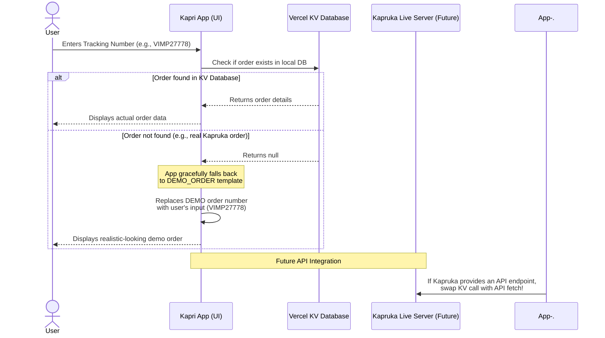

# Kapruka Agent Challenge 2026 — Project Documentation

This folder is the **single source of truth** for building the winning entry to the
Kapruka Agent Challenge. It is written to be consumed by **Claude Code**: point Claude
Code at this directory, tell it to read `CLAUDE.md` first, then work through the build
roadmap.

## Goal in one line

> Build Sri Lanka's most polished, full-screen, multilingual AI shopping agent on top of
> the public Kapruka MCP, deployed to a reliable public URL, and win the M4 Mac Mini.

## How to use these docs with Claude Code

1. Open a terminal in your new project repo.
2. Copy `CLAUDE.md` into the **repo root** (Claude Code reads it automatically).
3. Copy the rest of these `.md` files into a `/docs` folder in the repo.
4. Start Claude Code and say:
   > "Read CLAUDE.md and docs/00-PROJECT-BRIEF.md through docs/08-DEPLOYMENT.md.
   > Then execute the build roadmap in docs/06-BUILD-ROADMAP.md, starting at Phase 0."

## Reading order

| File | Purpose |
|------|---------|
| `CLAUDE.md` | The contract Claude Code follows. Conventions, guardrails, do/don't. |
| `00-PROJECT-BRIEF.md` | What we're building, the rubric, and the definition of "won". |
| `01-ARCHITECTURE.md` | The recommended stack + the *why*, with the .NET alternative. |
| `02-MCP-INTEGRATION.md` | The 7 Kapruka tools, schemas, the MCP client, rate limits. |
| `03-AGENT-ORCHESTRATION.md` | System prompt, tool loop, cart sync, Sinhala/Tanglish. |
| `04-FRONTEND-SPEC.md` | UI/UX, generative components, branding, file tree. |
| `05-DATA-MODELS.md` | TypeScript types for products, cart, orders, stream parts. |
| `06-BUILD-ROADMAP.md` | Phased plan with concrete milestones and acceptance checks. |
| `07-WINNING-STRATEGY.md` | Rubric-by-rubric tactics, bonus points, the judge demo script. |
| `08-DEPLOYMENT.md` | Vercel deploy, env vars, reliability, demo-day checklist. |

## The one-paragraph strategy

The rubric gives **50 of 100 points to look-and-feel** (Experience & Polish 30 + Visual
Richness 20). So the build order is deliberately *experience-first*: get a beautiful,
fast, full-screen chat shell rendering rich generative product UI before adding breadth.
Then close the loop end-to-end (discovery → cart → delivery validation → checkout pay
link). Then capture the **highest-leverage bonus**: Sinhala / Tanglish, which the brief
says almost nobody will attempt. Reliability of the public URL is treated as a
first-class requirement, not an afterthought — if the judges can't open it, nothing else
counts.

## Key facts (verified June 2026)

- **MCP endpoint:** `https://mcp.kapruka.com/mcp` — Streamable HTTP, no auth.
- **Limits:** 60 requests/min per IP across all tools; 30 `create_order`/hour per IP.
- **Brand palette (sampled from the official logo):** purple `#442A73`, yellow
  `#F9DB09`, white `#FFFFFF`. (Your research notes said green/orange — that was wrong.)
- **Stack of record:** Next.js 15 (App Router) + Vercel AI SDK 6 (`@ai-sdk/mcp` is now
  stable) + Anthropic Claude, deployed on Vercel.
- **Deadline:** entries close **30 June 2026**.

## System Architecture: Order Tracking Flow

## Frequently Asked Questions (FAQ)

**Q: I entered a real Kapruka order number (e.g., VIMP27778) in the tracking UI, but it shows me a demo order with Cake, Roses, and Chocolates. Why?**

A: You hit the nail right on the head! Because this is currently a prototype and isn't connected to Kapruka's real, private internal database, it has no way to actually fetch real-world orders from the live Kapruka servers.

Here is exactly what happens under the hood when you type a tracking number:
1. The app first checks its own database (the Vercel KV database we just set up) to see if you placed that order inside this demo app.
2. If it can't find it (because VIMP27778 is a real Kapruka order from the outside world, not from this demo), the app returns `null`.
3. Because this is a UI prototype, rather than showing a boring "Order Not Found" error, the app gracefully falls back to displaying the `DEMO_ORDER` template (the Cake, Roses, and Chocolates) so you can still see what the tracking UI looks like.
4. However, it dynamically replaces the number on that demo order with the one you typed (VIMP27778) so it feels realistic!
5. **Future Integration**: If Kapruka eventually provides a real API endpoint for order tracking (e.g., `https://api.kapruka.com/orders/VIMP27778`), we can easily swap out the Vercel KV database call in `OrderTracker.tsx` to fetch the real data from Kapruka's servers!
