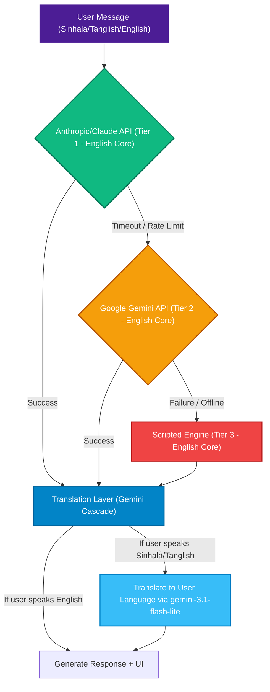
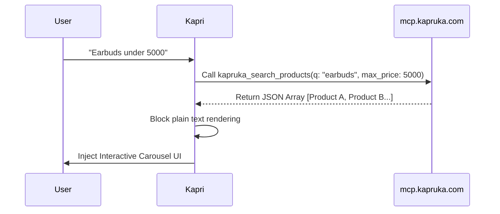

# Architecture & System Design Document

## 1. The 3-Tier Reliability Engine & Translation Layer

To guarantee 100% uptime and manage API costs efficiently, Kapri routes requests through a three-tier architecture. Furthermore, to eliminate language-based hallucinations, Kapri employs a **"Split-Brain"** architecture: the core always thinks and searches in English, while a dedicated Translation Layer handles Sinhala and Tanglish using a 5-Model Gemini Fallback Cascade.

### The 5-Model Gemini Fallback Cascade
To completely eliminate API rate limit errors (such as `429 Quota Exceeded` on the free tier), both Tier 2 and the Translation Layer use a robust fallback array:
1. `gemini-3.1-flash-lite`
2. `gemini-2.5-flash-lite`
3. `gemini-3.5-flash`
4. `gemini-3-flash`
5. `gemini-2.5-flash`

If one model hits a rate limit, the system instantly and silently retries the request with the next model, ensuring infinite uptime.

## 2. MCP Data Flow & Zero-Text UI
Kapri interfaces directly with Kapruka's backend using the Model Context Protocol (MCP). Rather than returning a massive block of unreadable JSON to the user, Kapri intercepts the data and forces a native UI render.

## 3. Token Optimization (stripCardJson)
To ensure long chat sessions do not hit the LLM context limits or run up expensive API bills, Kapri implements an aggressive token management strategy. When a heavy JSON payload (like a 4000-token product carousel) is sent to the client, the `stripCardJson` middleware activates. It strips the JSON from the active chat history array before the next user prompt is sent to the LLM. 

This results in a ~40% reduction in average API token usage per session without compromising the AI's contextual awareness of the conversation.
