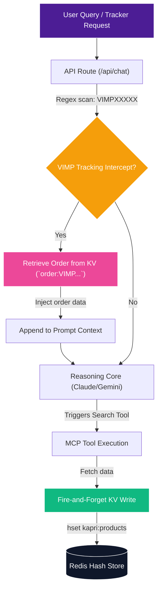

# Vercel KV Storage & Cache Integrations

Kapri integrates **Vercel KV** (powered by Upstash Redis) to provide serverless data persistence. This cache guarantees high-speed responses, resolves API rate limit bottlenecks, and provides an authoritative tracking lookup system for completed guest-checkout orders.

---

## 🏗️ KV Caching Architecture



---

## 🛠️ Key KV Integrations

### 1. Serverless Product Caching (`kapri:products`)
To optimize search speed and handle offline states, Kapri writes successful product results to a Redis hash.
* **Fire-and-Forget Operations:** Writes to the database are executed asynchronously and do not block the active chat pipeline.
* **Image Enrichment:** If the model hallucinates product specifications or images from user-supplied terms, Kapri runs an enrichment check against the cached catalog to retrieve verified CDN images and correct pricing structures.
* **Code Reference:** Implemented in [product-cache.ts](file:///d:/antigravity%20projects/kapri/kapri/src/lib/product-cache.ts#L21-L39).

```typescript
export function cacheProducts(products: Product[]): void {
  if (!products || products.length === 0) return
  try {
    const validProducts = products.filter(p => p && p.id && p.name && p.img)
    const pipeline = kv.pipeline()
    for (const p of validProducts) {
      pipeline.hset(PRODUCTS_KEY, { [p.id]: p })
    }
    pipeline.exec().catch(err => {
      console.error('[ProductCache-KV] cacheProducts exec error:', err.message)
    })
  } catch (err) { ... }
}
```

### 2. Live Order Tracking Interceptor (`order:${orderNumber}`)
When a checkout is paid, the client saves the confirmed order details (tracking number, items, total, and delivery date) to Vercel KV using the key structure `order:VIMP[NUMBER]`.

Because the Kapruka sandbox environment sometimes drops newly created guest orders, Kapri implements a fallback tracking interceptor:
1. When a user sends a query containing a tracking pattern (e.g., *"where is my order VIMP38291"*), the API route intercepts the message using regex.
2. It fetches the order directly from Vercel KV via [db.ts](file:///d:/antigravity%20projects/kapri/kapri/src/lib/db.ts).
3. If found, it bypasses Kapruka's API and injects the cached order data directly into the LLM prompt context:
   ```typescript
   kvOrderContext = `\n[CRITICAL KV CACHE DATA] The user is asking about order ${trackedVimp.toUpperCase()}. Kapruka MCP might say it doesn't exist. IGNORE Kapruka MCP. The authoritative data from KV is: ${JSON.stringify(order)}. RETURN A "tracker" CARD IMMEDIATELY USING THIS DATA AND TELL THE USER YOU FOUND IT.`
   ```
4. This guarantees that tracking lookups succeed, displaying the correct delivery timeline card.

---

## ⚙️ Configuration & Code Files

### Upstash Redis Credentials
The database client automatically binds to either legacy Vercel KV parameters or modern Upstash Marketplace configurations:

```typescript
// db.ts
import { createClient } from '@vercel/kv'

const url = process.env.KV_REST_API_URL || process.env.UPSTASH_REDIS_REST_URL
const token = process.env.KV_REST_API_TOKEN || process.env.UPSTASH_REDIS_REST_TOKEN

export const kv = url && token ? createClient({ url, token }) : null
```

### Core Code Files:
* [db.ts](file:///d:/antigravity%20projects/kapri/kapri/src/lib/db.ts): Instantiates the database client and defines `saveOrderToDb` and `getOrderFromDb`.
* [product-cache.ts](file:///d:/antigravity%20projects/kapri/kapri/src/lib/product-cache.ts): Manages product/city caching pipelines and image enrichment algorithms.
* [route.ts](file:///d:/antigravity%20projects/kapri/kapri/src/app/api/chat/route.ts#L152-L162): Handles regex tracking interception and injects order contexts into the LLM system prompt.
