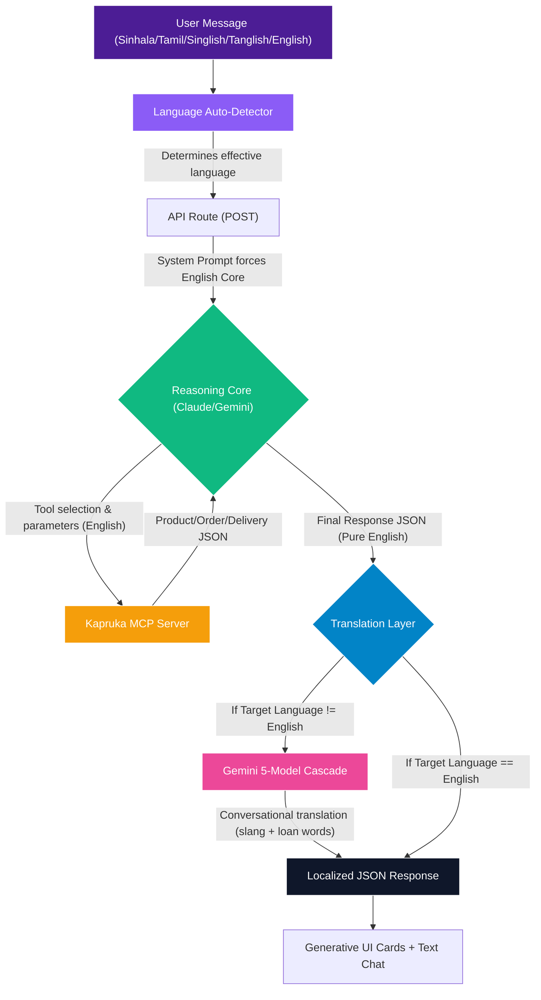

# "Split-Brain" Translation Architecture

The **"Split-Brain" Translation Architecture** is Kapri's solution to multi-lingual e-commerce search.

When forced to reason, select tools, and generate formatted JSON directly in a non-English language (like Sinhala or Tamil), Large Language Models (LLMs) frequently hallucinate, fail schema validations, and deliver poor search results because the underlying catalog and API expect English search terms.

Kapri solves this by decoupling the **Reasoning/MCP Core** from the **Translation & Localization Layer**.

---

## 🏗️ Architectural Overview



---

## 🧩 Core Components

### 1. Language Auto-Detection
The language detector automatically identifies if the user is typing in Sinhala, Tamil, English, or their romanized versions (Singlish/Tanglish).
* **Regex Scanning:** Detects Unicode ranges for Sinhala (`[඀-෿]`) and Tamil (`[\u0B80-\u0BFF]`).
* **Heuristics & Keywords:** Uses a predefined dictionary of common romanized keywords (such as `mata`, `gannako`, `oyage` for Singlish and `vanakkam`, `venum`, `vilai` for Tanglish) to count matches and resolve the correct dialect.
* **Code Reference:** Implemented in [detect-lang.ts](file:///d:/antigravity%20projects/kapri/kapri/src/lib/detect-lang.ts).

### 2. The English-Core Constraint
The Reasoning Core (whether running Claude or Gemini) is forced via [system-prompt.ts](file:///d:/antigravity%20projects/kapri/kapri/src/lib/system-prompt.ts) to execute all steps in English.
* It parses the user query (e.g., *"ammata birthday cake ekak ganna"*).
* It translates query semantics internally to search Kapruka tools (e.g., calls `kapruka_search_products(q: "birthday cake")`).
* It outputs the final response structure (text and suggestion chips) in pure English.

### 3. Decoupled Translation Layer
Once the English-Core returns a response, the system intercepts the payload in [route.ts](file:///d:/antigravity%20projects/kapri/kapri/src/app/api/chat/route.ts#L9-L25). If the target language is not English, it sends only the `text` and `chips` fields to the translator.
* The translation prompt enforces a **Conversational (Spoken) Dialect** rather than stiff, formal dictionary translations.
* It instructs the LLM to freely use English loan words (such as *delivery*, *budget*, *order*, *address*) where local Sri Lankans naturally use them.
* **Code Reference:** Implemented in [translator.ts](file:///d:/antigravity%20projects/kapri/kapri/src/lib/translator.ts).

---

## ⚡ Infinite Uptime: The 5-Model Gemini Cascade

Because translation requires high concurrency and rapid response times, Kapri routes all translation queries through a fallback cascade of 5 Google Gemini models. This setup ensures that if the system hits a rate limit or error on one model, it instantly switches to the next, maintaining 100% service availability.

The cascade order is as follows:
1. `gemini-3.1-flash-lite` (Fastest, primary translator)
2. `gemini-2.5-flash-lite`
3. `gemini-3.5-flash`
4. `gemini-3-flash`
5. `gemini-2.5-flash` (Ultimate fallback)

### Code Highlight: Fallback Loop in `translator.ts`
```typescript
for (const modelName of GEMINI_MODELS) {
  try {
    const { object } = await generateObject({
      model: google(modelName),
      system: SYSTEM_INSTRUCTION,
      prompt,
      schema: z.object({
        text: z.string(),
        chips: z.array(z.string()),
      }),
      temperature: 0.3,
    })
    return object
  } catch (err: any) {
    console.warn(`[Translator] Model ${modelName} failed:`, err.message)
    lastError = err
  }
}
```

---

## 💡 Benefits of this Design

1. **Perfect Search Precision:** Eliminates "no results found" errors on Kapruka’s English-indexed catalogs.
2. **Zero Hallucinations:** Prevents JSON schema degradation and tool-calling errors caused by non-English responses.
3. **Hyper-Localized Experience:** Naturally speaks the everyday, casual language Sri Lankan users are comfortable with.
