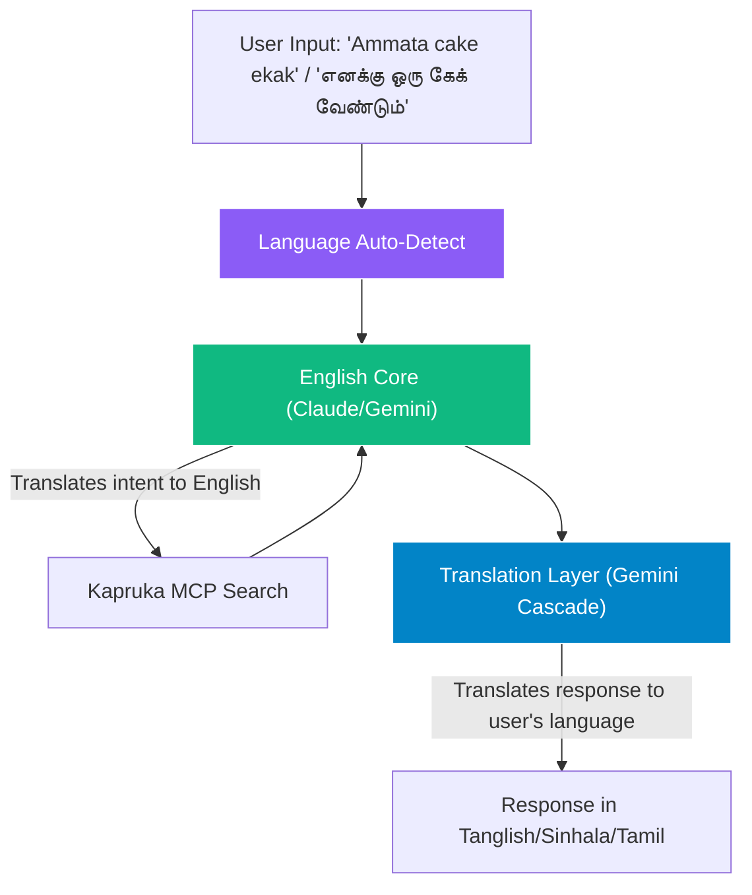
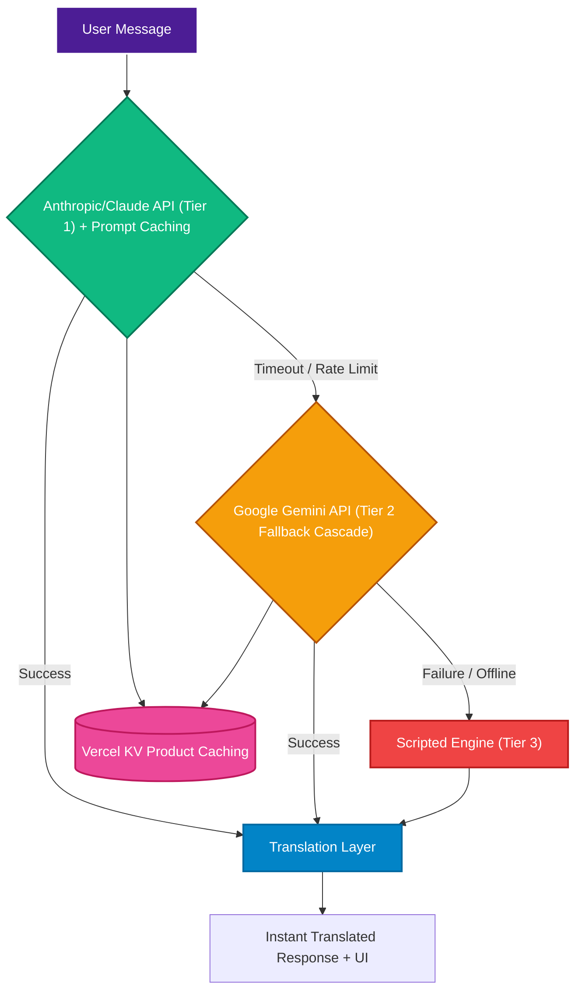
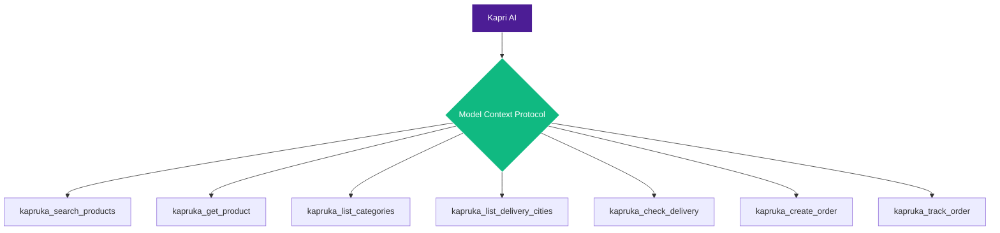
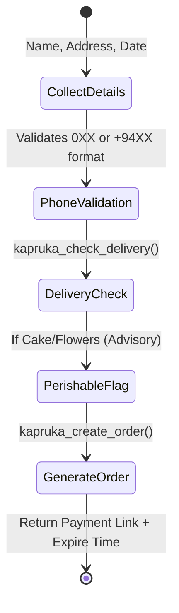
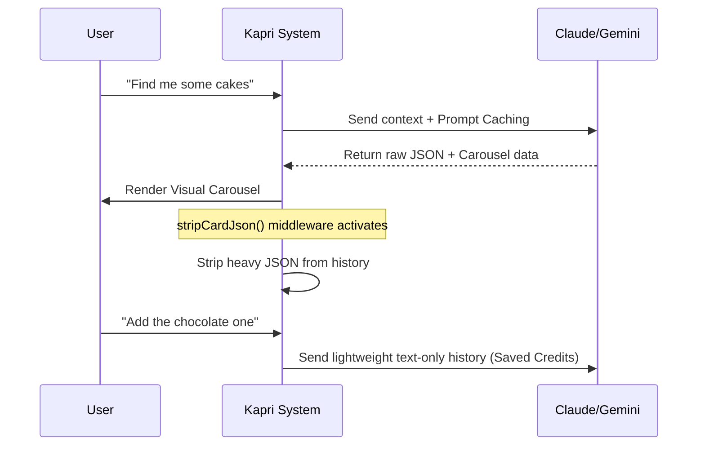

# Kapri AI — Product Demonstration Video Script

**Target Audience:** Tech judges, Kapruka stakeholders, and potential investors.
**Tone:** Professional, enthusiastic, human-like, and highly technical yet accessible.

---

## 🎬 [Scene 1: The Hook & Introduction]
**Visual:** Screen recording starts on the Kapri welcome page. An interactive onboarding overlay and empty state guide the user. The user types a simple greeting or clicks the voice button.

**Speaker:**
"Welcome, everyone. This is Kapri — Kapruka's premium AI shopping concierge. 

When we built Kapri, we had one strict rule: *Think bigger than a search box wearing a chat costume.* We wanted an AI that feels human, understands local Sri Lankan nuances, and most importantly, actually gets things done. Today, I'm going to walk you through how Kapri works under the hood, our new voice and UI capabilities, and the magic of our multi-engine architecture."

---

## 🎬 [Scene 2: The Multi-Language Engine with Auto-Detect]
**Visual:** Split screen showing the user chatting in English, Sinhala, Tamil, and Tanglish. The UI highlights the global language toggle automatically updating via auto-detect.

**Speaker:**
"Let's talk about the brain of Kapri. Sri Lankans don't just speak one language online. We mix English, Sinhala, Tamil, and 'Tanglish'. 

To handle this, we built a **'Split-Brain' Translation Architecture** with **Language Auto-Detect**. The problem with most AI agents is that when you force them to think and search in a local language, they hallucinate or fail to find products in an English database.

Kapri solves this brilliantly. No matter what language you speak—Sinhala, Tamil, or casual Tanglish—Kapri instantly detects it, translates your intent into pure English to query the Kapruka database flawlessly. Then, a dedicated **Translation Layer** intercepts the English output and flawlessly translates it back into your exact dialect. 

The global language toggle updates automatically across devices, ensuring a seamless localized experience without compromising search accuracy."

---

## 🎬 [Scene 3: The 3-Tier Reliability Engine & KV Caching]
**Visual:** A flowchart graphics showing the routing logic: Tier 1 (Claude MCP) → Tier 2 (Gemini Backup) → Tier 3 (Scripted Engine Fallback), with Vercel KV attached.

**Speaker:**
"Now, an AI assistant is only as good as its uptime and speed. We couldn't afford for Kapri to go down if an API hit a rate limit. So, we engineered a unique **3-Tier Reliability Engine powered by an Infinite-Uptime Fallback Cascade**.

**Tier 1** is our primary workhorse: **Anthropic's Claude 3.5 Haiku**. We use Claude because of its superior reasoning and emotional intelligence. 

**Tier 2** and our **Translation Layer** are powered by Google Gemini. To completely eliminate free-tier API crashes, Kapri uses a robust multi-model cascade. If a request hits a rate limit, the system instantly cascades to a fallback model, ensuring the user never sees an error.

**Tier 3** is our safety net: The **Scripted Engine**. For simple greetings or offline scenarios, this blazing-fast engine takes over.

But that's not all. We've introduced **Vercel KV Product Caching**. When a product is searched once, it's cached. Subsequent queries retrieve details instantly from the KV store, massively reducing API latency and load."

---

## 🎬 [Scene 4: The Kapruka MCP Architecture & Advanced Capabilities]
**Visual:** The screen transitions to a sequence demonstrating the user asking to compare products and negotiate a budget.

**Speaker:**
"To give Kapri the power to act, we integrated it directly into Kapruka's backend using the Model Context Protocol (MCP), exposing 7 highly specialized tools. It can search products, check real-time delivery dates for specific cities, and fetch high-res images.

But where Kapri truly shines is in its advanced capabilities: **Product Comparisons and Budget Negotiation.**

Watch what happens when I ask to compare two different earbuds. 
*[Visual: Interactive Compare Mode UI pops up with side-by-side images and specs]*
Kapri doesn't just list them; it triggers our Compare Mode, pulling cached images and specs flawlessly to render a side-by-side comparison directly in the chat.

And if I say, 'My budget is only 5000 rupees,' Kapri dynamically negotiates, filtering the catalog using MCP tools to suggest the best alternatives within that exact price range."

---

## 🎬 [Scene 5: The Checkout Workflow & Validation]
**Visual:** The user builds a gift bundle and the checkout modal opens. A payment expiration countdown is visible.

**Speaker:**
"We also added significant polish to the checkout experience. Kapri handles all the heavy lifting. It validates Sri Lankan mobile numbers dynamically. 

It checks exact delivery availability in real-time. If you order a perishable item like a cake, the system flags it in the UI with a gentle advisory note. It calculates the base delivery rate, generates a payment link, and even sets a strict **Payment Expire Time** to hold inventory securely."

---

## 🎬 [Scene 6: Cost Optimization (The Secret Sauce)]
**Visual:** Display a technical architectural sequence diagram showing the `stripCardJson` flow and Prompt Caching.

**Speaker:**
"Running an advanced AI agent can get expensive fast. We implemented aggressive optimizations to cut our API costs without losing conversational quality.

First, we introduced **Prompt Caching** at the API level, allowing us to reuse system prompts and save API credits on every turn. 

Second, we built a `stripCardJson` middleware. When Kapri renders a massive JSON payload for a product carousel, we *strip that data out* of the chat history before sending the next message to the LLM. The AI only remembers the human conversation, not the heavy UI code."

---

## 🎬 [Scene 7: Post-Purchase & Conclusion]
**Visual:** The user clicks "Track an order", types a tracking number, and it instantly loads from the KV table.

**Speaker:**
"Finally, we expanded Kapri's scope. It's not just for gifting anymore. It's for everyday shopping. 

We completely overhauled our tracking system, now powered by a blazing-fast **KV table** lookup, ensuring instant delivery updates. With a clean, mobile-first design, a built-in voice button, and support for four languages, Kapri isn't just an experiment; it's a fully realized, production-ready concierge that blends emotional intelligence with hard e-commerce utility. 

Thank you for watching!"
