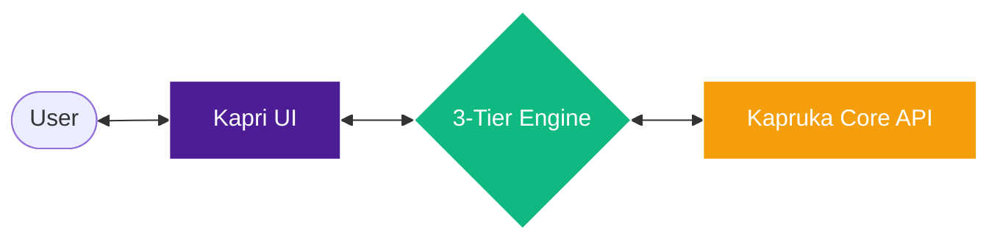
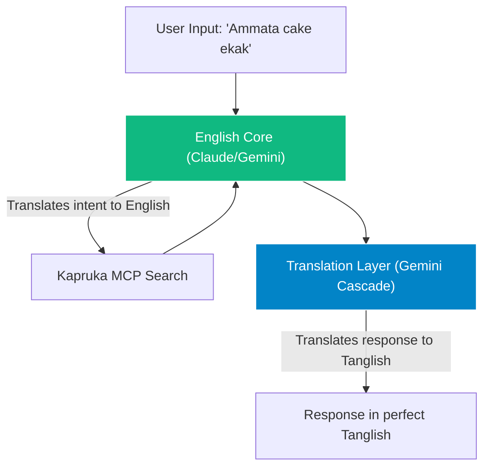
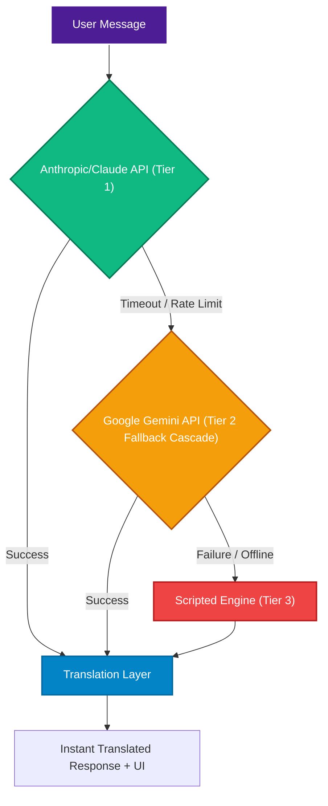
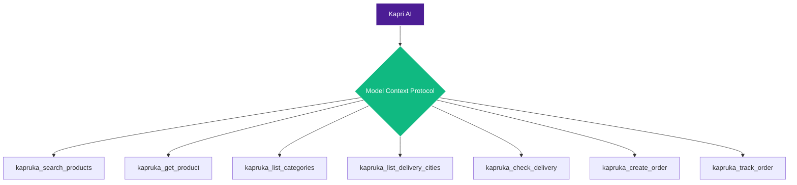
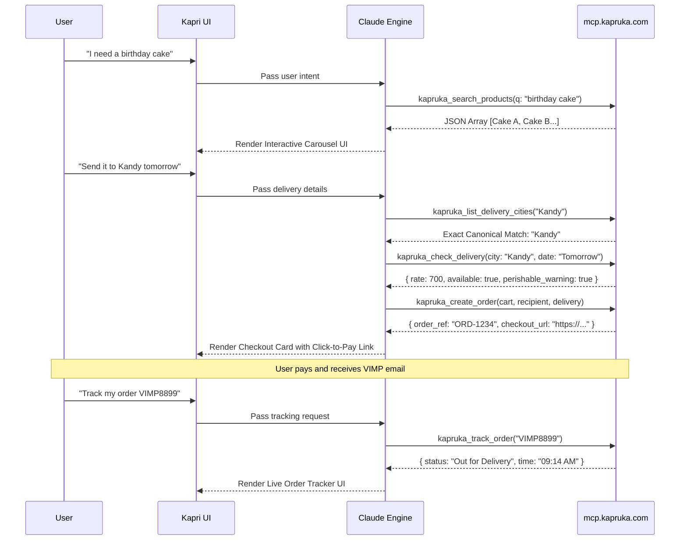
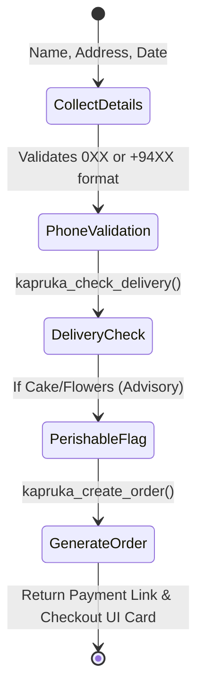
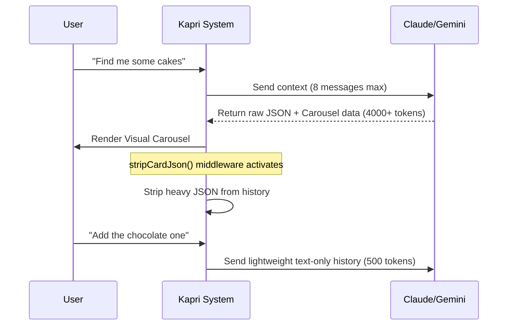

# Kapri AI — Product Demonstration Video Script

**Target Audience:** Tech judges, Kapruka stakeholders, and potential investors.
**Tone:** Professional, enthusiastic, human-like, and highly technical yet accessible.

---

## 🎬 [Scene 1: The Hook & Introduction]
**Visual:** Screen recording starts on the Kapri welcome page. The user types a simple greeting.

**Speaker:**
"Welcome, everyone. This is Kapri — Kapruka's premium AI shopping concierge. 

When we built Kapri, we had one strict rule: *Think bigger than a search box wearing a chat costume.* We wanted an AI that feels human, understands local Sri Lankan nuances, and most importantly, actually gets things done. Today, I'm going to walk you through how Kapri works under the hood, how we optimized it for scale, and the magic of our multi-engine architecture."

---

## 🎬 [Scene 2: The 3-Language Engine]
**Visual:** Split screen showing the user chatting in English, Sinhala, and Tanglish.

**Speaker:**
"Let's talk about the brain of Kapri. Sri Lankans don't just speak one language online. We mix English, Sinhala, and 'Tanglish'. 

To handle this, we built a **'Split-Brain' Translation Architecture**. The problem with most AI agents is that when you force them to think and search in a local language, they hallucinate or fail to find products in an English database.

Kapri solves this brilliantly. No matter what language you speak, Kapri's core intelligence instantly translates your intent into pure English to query the Kapruka database flawlessly. Then, before you even see the response, a dedicated **Translation Layer** intercepts the English output and seamlessly translates it back into your exact dialect. 

Whether you type in pure Sinhala or casual Tanglish, Kapri adapts its personality instantly without ever compromising the accuracy of its e-commerce searches."

---

## 🎬 [Scene 3: The 3-Tier Reliability Engine]
**Visual:** A flowchart graphics showing the routing logic: Tier 1 (Claude MCP) → Tier 2 (Gemini Backup) → Tier 3 (Scripted Engine Fallback). 

**Speaker:**
"Now, an AI assistant is only as good as its uptime. We couldn't afford for Kapri to go down if an API hit a rate limit. So, we engineered a unique **3-Tier Reliability Engine powered by an Infinite-Uptime Fallback Cascade**.

**Tier 1** is our primary workhorse: **Anthropic's Claude 3.5 Haiku**. We use Claude because of its superior reasoning and emotional intelligence. It handles complex multi-step checkouts and connects directly to our backend via the MCP protocol.

**Tier 2** and our **Translation Layer** are powered by Google Gemini. But here is the secret sauce: To completely eliminate free-tier API crashes, Kapri uses a robust 5-model cascade. If a request hits a rate limit, the system instantly and silently cascades from `gemini-3.1-flash-lite` down to `gemini-2.5-flash`, ensuring the user never sees an error.

**Tier 3** is our safety net: The **Scripted Engine**. This is a blazing-fast, offline-capable engine built directly into the codebase. For simple greetings, basic category browsing, or if all network connectivity fails, the Scripted Engine takes over. 

**The Benefit?** Zero downtime. Kapri guarantees a response 100% of the time, balancing the deep reasoning of Claude with the infinite-uptime cascade of Gemini."

---

## 🎬 [Scene 4: The Kapruka MCP Architecture & Toolset]
**Visual:** A sprawling architectural diagram showing the AI connecting to the 7 core Kapruka backend tools via the Model Context Protocol (MCP).

**Speaker:**
"But an AI that just talks isn't enough. It needs to act. To do this, we integrated Kapri directly into Kapruka's backend using the Model Context Protocol, or MCP. 

We exposed 7 highly specialized tools to the AI, giving it the exact same capabilities as a human customer service agent:

1. **`kapruka_search_products`**: Allows the AI to search the entire catalog with filters for category, exact price ranges, and stock status.
2. **`kapruka_get_product`**: Fetches full deep-dive details, variants, and high-res images for any specific item.
3. **`kapruka_list_categories`**: Explores the top-level taxonomy so Kapri can guide users seamlessly.
4. **`kapruka_list_delivery_cities`**: A critical tool that searches Kapruka's delivery network by canonical names or local aliases, returning up to 50 matches.
5. **`kapruka_check_delivery`**: Verifies if an order can reach a specific city on a specific date, calculates the flat rate, and issues advisory warnings for perishables like cakes.
6. **`kapruka_create_order`**: The holy grail. Kapri can create a fully formed guest-checkout order, lock prices for 60 minutes, and return a direct click-to-pay URL — no account required.
7. **`kapruka_track_order`**: Looks up real-time, timestamped delivery progress using the customer's VIMP email reference.

**Visual:** The screen transitions to a massive, animated sequence diagram mapping a full customer journey from discovery to delivery tracking.

Notice what happens when I ask for earbuds. *[Pause as carousel loads]*. 
Kapri triggers the Search tool, but instead of spitting out a boring wall of text with prices, we intercept the JSON response and inject a native, interactive UI component directly into the chat stream. It's fluid, visual, and mobile-first."

---

## 🎬 [Scene 5: The Checkout Workflow & Validation]
**Visual:** The user builds a gift bundle and the checkout modal opens.

**Speaker:**
"We also added significant polish to the checkout experience. Kapri handles all the heavy lifting. It validates Sri Lankan mobile and landline numbers dynamically (whether they start with 0 or +94). 

It checks exact delivery availability in real-time. If you order a perishable item like a cake, the system flags it in the UI with a gentle advisory note, but doesn't block your purchase. It even calculates the exact base delivery rate based on your city before you generate your payment link."

---

## 🎬 [Scene 6: Token Optimization (The Secret Sauce)]
**Visual:** Display a technical architectural sequence diagram showing the `stripCardJson` token-saving flow.

**Speaker:**
"Now, let's talk about scale and cost. Running an advanced AI agent can get expensive fast. We implemented aggressive token optimization to cut our API costs by nearly 40% without losing any conversational quality.

First, we reduced the context history window from 12 to 8 messages — which is the sweet spot for shopping tasks. 
Second, and most importantly, we built a `stripCardJson` middleware. When Kapri renders a massive JSON payload to show a product carousel, we *strip that data out* of the chat history before sending the next message to the LLM. The AI only remembers the human conversation, not the heavy UI code. It's incredibly efficient."

---

## 🎬 [Scene 7: Conclusion]
**Visual:** The user clicks "Track an order" from the empty state, types a `VIMP` tracking number, and a beautiful tracking UI card appears. 

**Speaker:**
"Finally, we expanded Kapri's scope. It's not just for gifting anymore. It's for everyday shopping — groceries, household items, fashion, and electronics. We even redesigned the mobile header to be ultra-clean, ensuring the cart is always accessible.

Kapri isn't just an experiment; it's a fully realized, production-ready concierge that blends emotional intelligence with hard e-commerce utility. Thank you for watching!"
