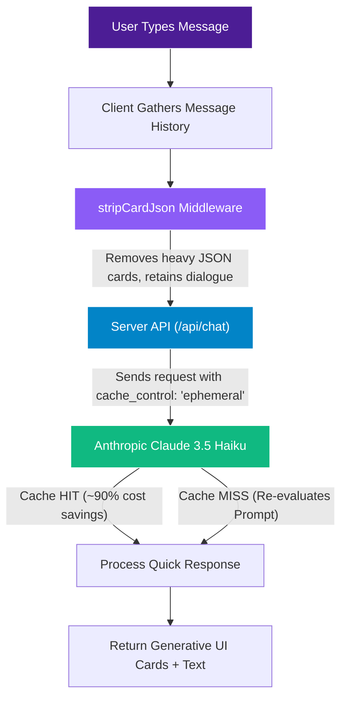

# Prompt Caching & Token Optimization

Shopping sessions with AI concierges can grow extremely long as users browse, compare, and modify carts. Without optimization, sending the entire conversation history, active cart state, product catalogs, and detailed system prompt on every message leads to high latency and high API costs.

Kapri addresses this using two complementary technologies: **Anthropic Ephemeral Prompt Caching** and **Client-Side Token Stripping Middleware (`stripCardJson`)**.

---

## 🛠️ Optimization Architecture



---

## 🏎️ Anthropic Prompt Caching

Kapri uses **Anthropic’s Ephemeral Prompt Caching** to speed up processing. The system prompt contains extensive rules about trilingual parsing, conversational guidelines, categories, dynamic cart arrays, and favorites, totaling over **3,000 tokens**.

By using the caching API, the system prompt is compiled once and held in Anthropic's cache memory. Subsequent turns hit the cache, lowering costs and reducing latency.

### Code Implementation
In the primary backend endpoint [route.ts](file:///d:/antigravity%20projects/kapri/kapri/src/app/api/chat/route.ts#L70), the cache property is declared:

```typescript
const requestParams = (extraMessages: any[] = []): any => ({
  model: MODEL,
  max_tokens: 2048,
  cache_control: { type: 'ephemeral' },
  system: buildSystemPrompt(cart, lastVimp, favorites, lang, kvOrderContext),
  messages: [...messages, ...extraMessages],
  betas: ['mcp-client-2025-11-20'],
  mcp_servers: [{ type: 'url', url: 'https://mcp.kapruka.com/mcp', name: 'kapruka' }],
  tools: [{ type: 'mcp_toolset', mcp_server_name: 'kapruka' }],
  tool_choice: { type: 'auto', disable_parallel_tool_use: true },
})
```

---

## ✂️ The Client-Side `stripCardJson` Middleware

While the prompt cache keeps the system prompt hot, chat history can still grow rapidly. Under Kapri's **Zero Plain-Text UI** rule, the assistant replies with a structured JSON string containing large payloads of product arrays, comparison details, or order info.

If left raw, a single product carousel can add **4,000+ tokens** to the message history. In subsequent turns, the LLM would have to re-evaluate this layout code, increasing latency and cost.

### How it Works
The `stripCardJson` middleware solves this:
1. When Kapri returns a response, it is a unified JSON block containing both a conversational `text` field and a structural `card` details block.
2. The client renders the rich component (like `<ProductCarousel>`) on the screen.
3. Before submitting the conversation history back to the API for the next turn, Kapri's middleware intercepts the message array in [App.tsx](file:///d:/antigravity%20projects/kapri/kapri/src/components/App.tsx#L201-L208).
4. It parses the JSON block, extracts *only* the conversational text string, and strips out the structural JSON cards entirely.

### Code Implementation in `App.tsx`
```typescript
// Strip card/carousel JSON from Kapri's past replies to save API tokens.
// The AI doesn't need to re-read its own product cards — just the conversational text.
const stripCardJson = (raw: string): string => {
  if (!raw) return ''
  try {
    const parsed = JSON.parse(raw)
    if (parsed && typeof parsed.text === 'string') return parsed.text
  } catch { /* not JSON, return as-is */ }
  return raw
}

// Applying it during history mapping
const history = [...msgs, userMsg].map(m => ({
  role: (m.role === 'user' ? 'user' : 'assistant') as 'user' | 'assistant',
  text: m.role === 'kapri' ? stripCardJson(m.text || '') : (m.text || ''),
  image: m.role === 'user' ? m.image : undefined
})).filter(m => m.text.trim() || m.image)
```

---

## 📈 Impact Analysis

* **Token Savings:** Reduces average context sizes by **~40%** per session.
* **Latency Reduction:** Time-to-First-Token (TTFT) drops to **sub-second** ranges on cached prompts.
* **Context Preservation:** Prevents users from hitting context limits during long browsing sessions.
