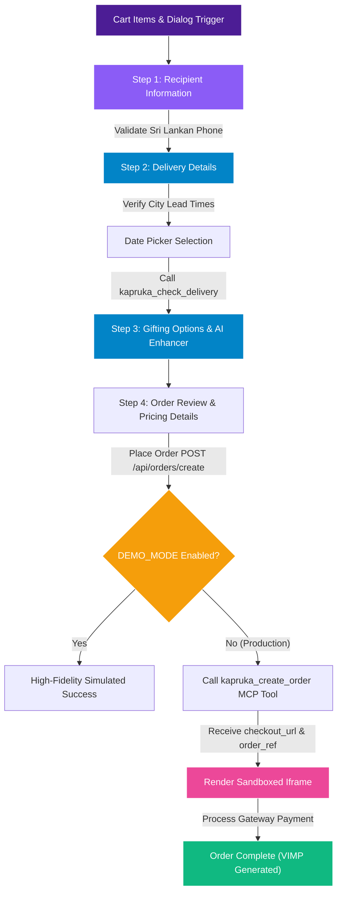

# Real End-to-End Checkout Flow

The checkout system in Kapri is designed to handle the entire shopping pipeline — transitioning seamlessly from product discovery to secure payment. Rather than redirecting users to an external website, Kapri handles validation, delivery rules, and order processing entirely within the application.

---

## 🔁 Checkout Architecture

---

## 📋 Step-by-Step Checkout Implementation

### 1. Recipient Details & Phone Validation
The flow begins by capturing recipient details. It implements strict validation rules for Sri Lankan phone numbers:
* **Formats Supported:** Accepts standard local formats starting with `07X...` (10 digits) or country code format starting with `+947X...` (12 digits).
* **Regex Engine:** Evaluates input values using `/^(?:0\d{9}|\+94\d{9})$/` to prevent delivery coordinate errors.

### 2. Delivery Scheduling & City Validation
Kapri checks delivery constraints in real-time, queryable by city:
* **City Autosuggestion:** Integrated with the `kapruka_list_delivery_cities` dataset to fetch canonical city names and base delivery rates.
* **Lead-Time Rules:** Slow delivery cities (located outside Colombo/Suburbs) have a mandatory 2-day lead time. This rule programmatically disables the earliest dates on the datepicker to avoid logistics failures.
* **Sunday Rule Check:** For slow zones, deliveries are blocked on Sundays. If a user selects a Sunday, Kapri triggers a warning message suggesting the next available Monday.
* **Perishable Warnings:** If the cart contains fresh cakes, flowers, or combo boxes, Kapri shows a warning badge reminding the sender to ensure the recipient is home to receive the fresh delivery.

### 3. Gifting Options & "Magic Wand" Message Enhancer
To elevate the gifting experience, Kapri includes a trilingual **AI Message Enhancer**:
* **Selectable Tones:** Users can pick between **Warm** (紫色/Purple), **Witty** (😄/Smiling), and **Formal** (🎩/Top-hat).
* **Dynamic Rewriting:** Generates localized and stylized messages in English, Sinhala, and Singlish/Tanglish depending on the detected language context.
* **Code Reference:** Implemented within the `<GiftMessageEditor>` component in [CheckoutFlow.tsx](file:///d:/antigravity%20projects/kapri/kapri/src/components/overlays/CheckoutFlow.tsx#L84-L121).

### 4. Review & Final Totals
Presents a detailed itemization, showing a subtotal, estimated base shipping rate, and total cost. It also details recipient, date, sender, and anonymous shipping statuses before making the backend API request.

---

## 🔒 Payment Processing (The Secure Iframe)

When the user submits the form, Kapri executes a server-side route that creates the order directly via Kapruka:

1. **Guest Checkout Order:** A POST request is sent to `/api/orders/create` with cart, recipient, delivery, sender, and message details.
2. **MCP Tool Loop:** The API route triggers the `kapruka_create_order` tool via [kapruka-mcp.ts](file:///d:/antigravity%20projects/kapri/kapri/src/lib/kapruka-mcp.ts).
3. **Response Envelope:** If successful, Kapruka reserves inventory, locks the pricing for **60 minutes**, and returns a secure `checkout_url`.
4. **Sandboxed Iframe:** The web client loads this URL inside a sandboxed `<PaymentFrame>` React iframe, allowing the user to securely interact with the Kapruka pay-gateway without leaving the Kapri application workspace.

---

## ⚙️ Configuration & Code Files

### `DEMO_MODE` Flag
For development and demonstration runs, a `DEMO_MODE` flag is exposed in [CheckoutFlow.tsx](file:///d:/antigravity%20projects/kapri/kapri/src/components/overlays/CheckoutFlow.tsx#L206):
* **`DEMO_MODE = true` (Default):** Bypasses real API calls to Kapruka (avoiding spamming the order endpoints with dummy data) and simulates a successful checkout transition with mock tracking IDs.
* **`DEMO_MODE = false`:** Initiates live guest-checkouts, executing real requests against `mcp.kapruka.com`.

### Core Checkout Files:
* [CheckoutFlow.tsx](file:///d:/antigravity%20projects/kapri/kapri/src/components/overlays/CheckoutFlow.tsx): Houses form states, validations, lead-time date calculations, and render screens.
* [route.ts](file:///d:/antigravity%20projects/kapri/kapri/src/app/api/orders/create/route.ts): Handles client-to-MCP API endpoint routing.
* [kapruka-mcp.ts](file:///d:/antigravity%20projects/kapri/kapri/src/lib/kapruka-mcp.ts): Low-level Server-Sent Events (SSE) listener and JSON-RPC initialization wrapper to interact with the Kapruka MCP server.
